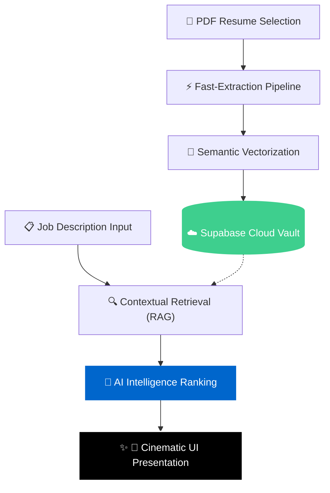

#  Resume Intelligence: High-Precision Candidate Discovery


An ultra-premium, AI-driven candidate screening engine designed to evaluate resumes with high-fidelity precision. This platform leverages modern RAG (Retrieval-Augmented Generation) architectures to match candidate credentials against complex job requirements with cinematic visual clarity.

---

## 🎨 Design Philosophy: "The Apple Standard"

This repository features a complete UI/UX overhaul inspired by high-end minimalist design systems. We prioritized **vertical rhythm**, **refractive glass surfaces**, and **cinematic typography** to deliver an experience that feels like a native macOS application.

### Key UX Pillars:
- **Clean Focus**: A single-line hero header and absolute minimalist input surfaces.
- **Glassmorphism**: A "Liquid Glass" navigation system with `backdrop-blur-2xl` and refractive shadows.
- **Micro-Interactions**: Spring-animated error handling and requirement-stack validation meters.
- **The File Cabinet**: A non-intrusive slide-out registry that manages candidates without shifting the main workspace.

---

## ⚙️ Core Architecture

The system is built on a robust distributed architecture ensuring zero-persistence local state and persistent cloud-based intelligence.

### 🔄 Logic Flow & System Architecture


### 🧩 Backend (FastAPI)
- **RAG Pipeline**: Utilizes vector embeddings to perform semantic search across candidate resumes.
- **LLM Synthesis**: Direct integration with high-end models for candidate ranking and comparative analysis.
- **Persistence Layer**: Fully powered by **Supabase** (PostgreSQL + Vector) for reliable data hydration and multi-resume management.
- **Auto-Hydration**: On startup, the engine hydrates in-memory repositories from the cloud to ensure immediate availability.

### ⚛️ Frontend (React/Vite)
- **High-Performance**: Built on Vite for near-instant interaction response times.
- **Fluid Motion**: Powered by `framer-motion` for complex drawer transitions and spring-based layouts.
- **Atomic Components**: A library of custom-built pill buttons, input cards, and result cards standardized under a unified black/white design system.
- **Intelligent Validation**: Real-time comma-based skill parsing and interactive setup guidance.

---

## 🚀 Quick Start (Local Development)

### 1. Intelligence Engine (Backend)
```bash
cd backend
pip install -r requirements.txt
# Configure your .env with SUPABASE_URL, SUPABASE_SERVICE_KEY, and HF_TOKEN
uvicorn main:app --reload
```

### 2. Interface (Frontend)
```bash
cd frontend
npm install
npm run dev
```

---

## 🛠 Features at a Glance
- **Multi-Resume Batching**: Upload dozens of candidate resumes simultaneously.
- **File Cabinet Management**: Slide-out access to all candidates with real-time match scores.
- **The Verdict**: Detailed comparative analysis between top-tier candidates.
- **High-Contrast Error Prevention**: intelligent banners that help you fix setup mistakes before they happen.
- **Global Minimalist Scrollers**: Custom-designed scrollbars that match the application's aesthetic.

---

## 📜 Credits & Licensing
- **Original Engine**: Developed by [Shivam8292](https://github.com/Shivam8292)
- **UI/UX Overhaul**: Refined by [Harshal Patel](https://github.com/HarshalPatel1972)
- **License**: MIT License (See repository for details)

---

> [!NOTE]
> This project is designed for high-end human resources screening. Always verify candidate credentials beyond automated scoring.
